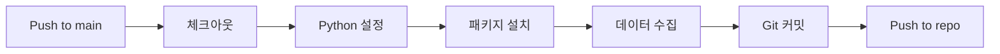

# 해외시장 지수 자동 수집 시스템

장 시작 전 필수 체크 사항을 자동으로 수집하는 시스템입니다.

---

## 📋 목차

1. [시스템 개요](#시스템-개요)
2. [크롤링 대상 지수](#크롤링-대상-지수)
3. [프로젝트 구조](#프로젝트-구조)
4. [설치 및 실행](#설치-및-실행)
5. [GitHub Actions 자동화](#github-actions-자동화)
6. [API 사용법](#api-사용법)
7. [데이터 형식](#데이터-형식)
8. [법적 주의사항](#법적-주의사항)

---

## 🎯 시스템 개요

이 시스템은 해외 주요 시장 지수를 자동으로 크롤링하여 날짜별 JSON 파일로 저장합니다.

### 주요 기능

- 🔄 **자동 데이터 수집**: GitHub Actions를 통해 매일 자동으로 실행
- 📊 **실시간 지수 조회**: FastAPI를 통한 REST API 제공
- 💾 **날짜별 저장**: `data/global_point_YYYY-MM-DD.json` 형식으로 저장
- 🌍 **다국가 지원**: 미국, 아시아, 유럽 주요 지수

---

## 🌍 크롤링 대상 지수

### 미국 시장 (US Market)

| 지수 심볼 | 지수명      | 중요도     |
| --------- | ----------- | ---------- |
| dow       | 다우존스    | ⭐⭐⭐⭐⭐ |
| sp500     | S&P 500     | ⭐⭐⭐⭐⭐ |
| nasdaq    | 나스닥      | ⭐⭐⭐⭐⭐ |

### 아시아 시장 (Asia Market)

| 지수 심볼 | 지수명      | 중요도   |
| --------- | ----------- | -------- |
| nikkei    | 닛케이225   | ⭐⭐⭐   |
| hangseng  | 항셍        | ⭐⭐⭐   |
| shanghai  | 상해종합    | ⭐⭐⭐⭐ |
| shenzhen  | 심천성분    | ⭐⭐⭐⭐ |

### 유럽 시장 (Europe Market)

| 지수 심볼 | 지수명      | 중요도 |
| --------- | ----------- | ------ |
| stoxx50   | STOXX 50    | ⭐⭐   |
| ftse      | FTSE 100    | ⭐⭐   |
| dax       | DAX         | ⭐⭐   |

---

## 📁 프로젝트 구조

```
03bigpro/
├── .github/
│   └── workflows/
│       └── deploy.yml          # GitHub Actions 워크플로우
├── crawlers/
│   ├── __init__.py
│   └── market_crawler.py       # 크롤링 모듈
├── data/
│   ├── .gitkeep
│   └── global_point_*.json     # 수집된 데이터 (날짜별)
├── main.py                     # FastAPI 서버
├── collect_data.py             # 데이터 수집 스크립트
├── requirements.txt            # Python 패키지
├── Dockerfile                  # Docker 이미지 설정
└── Readme.md                   # 프로젝트 문서
```

---

## 🚀 설치 및 실행

### 1. 저장소 클론

```bash
git clone <repository-url>
cd 03bigpro
```

### 2. 패키지 설치

```bash
pip install -r requirements.txt
```

### 3. 데이터 수집 (단독 실행)

```bash
python collect_data.py
```

### 4. API 서버 실행

```bash
python main.py
```

서버가 시작되면 http://localhost:8000 에서 접근 가능합니다.

API 문서: http://localhost:8000/docs

---

## ⚙️ GitHub Actions 자동화

### 자동 실행 조건

1. **Push 트리거**: `main` 브랜치에 push할 때마다 자동 실행
2. **스케줄 실행**: 매일 UTC 0시 (한국 시간 오전 9시)에 자동 실행
3. **수동 실행**: GitHub Actions 탭에서 수동으로 실행 가능

### 워크플로우 동작



### 실행 결과

- 수집된 데이터는 `data/global_point_YYYY-MM-DD.json` 파일로 저장
- GitHub Actions가 자동으로 커밋 및 푸시
- 커밋 메시지: `📊 해외시장 지수 데이터 수집: YYYY-MM-DD HH:MM:SS`

---

## 📡 API 사용법

### 기본 엔드포인트

#### 1. API 정보 조회

```http
GET /
```

#### 2. 전체 지수 조회

```http
GET /market/indices
```

#### 3. 지역별 지수 조회

```http
GET /market/indices?region=us
GET /market/indices?region=asia
GET /market/indices?region=europe
```

#### 4. 특정 지수 조회

```http
GET /market/index/{symbol}
```

예시:
```http
GET /market/index/dow
GET /market/index/nasdaq
GET /market/index/nikkei
```

#### 5. 시장 요약

```http
GET /market/summary
```

#### 6. 데이터 수집 (수동)

```http
POST /market/collect
```

---

## 📄 데이터 형식

### JSON 파일 구조

```json
{
  "update_time": "2026-01-24T15:30:00.123456",
  "us_market": [
    {
      "symbol": "dow",
      "name": "다우존스",
      "current_price": 38000.50,
      "previous_close": 37950.25,
      "change": 50.25,
      "change_percent": 0.13,
      "currency": "USD",
      "market_state": "REGULAR",
      "timestamp": "2026-01-24T15:30:00"
    }
  ],
  "asia_market": [...],
  "europe_market": [...],
  "total_count": 10
}
```

### 필드 설명

| 필드 | 타입 | 설명 |
|------|------|------|
| symbol | string | 지수 심볼 (예: dow, sp500) |
| name | string | 지수 이름 (예: 다우존스) |
| current_price | float | 현재 가격 |
| previous_close | float | 전일 종가 |
| change | float | 변동폭 |
| change_percent | float | 변동률 (%) |
| currency | string | 통화 (USD, JPY 등) |
| market_state | string | 시장 상태 (REGULAR, CLOSED 등) |
| timestamp | string | 데이터 수집 시간 (ISO 8601) |

---

## ⚠️ 법적 주의사항

### 크롤링 관련

1. **robots.txt 준수**: 웹사이트의 robots.txt를 확인하고 준수합니다.
2. **서버 부하 최소화**: 적절한 요청 간격을 유지합니다.
3. **개인 용도**: 이 시스템은 개인적인 투자 참고용으로만 사용하세요.
4. **상업적 사용 금지**: 수집된 데이터의 상업적 사용은 금지됩니다.

### 투자 경고

- 📊 이 데이터는 참고용이며 투자 결정의 유일한 근거로 사용하지 마세요.
- ⚠️ 모든 투자 결정은 본인의 책임입니다.
- 🔍 추가적인 분석과 전문가 상담을 권장합니다.

---

## 🛠️ 기술 스택

- **Python 3.10+**: 프로그래밍 언어
- **FastAPI**: REST API 프레임워크
- **Requests**: HTTP 클라이언트
- **BeautifulSoup4**: HTML 파싱 (필요시)
- **GitHub Actions**: CI/CD 자동화
- **Docker**: 컨테이너화 (선택사항)

---

## 📝 라이선스

이 프로젝트는 교육 및 개인 학습 목적으로 제작되었습니다.

---

## 🤝 기여

이슈 및 풀 리퀘스트는 환영합니다!

---

**마지막 업데이트**: 2026-01-24
